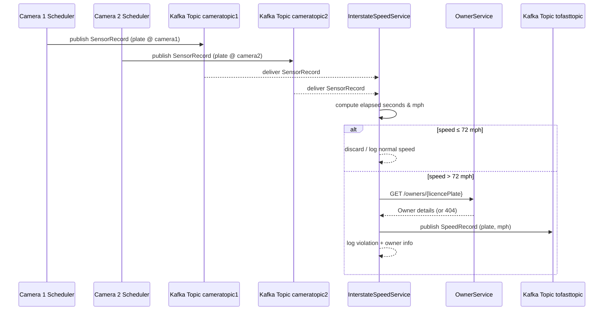

# Interstate Speed Monitoring – Part 1

## Overview
This lab wires the simulated interstate cameras to an automated speed enforcement pipeline. Camera sensors publish plate sightings to Kafka topics. The speed service consumes both streams, computes mph for every vehicle, and flags violations above 72 mph. For each violator it logs the owner details (queried from the owner service) and forwards the speeding record to a Kafka topic for downstream processing.

## Implementation Highlights
- Added Kafka consumer/producer support in `InterstateSpeedService` and created `SensorRecordListener` to subscribe to `cameratopic1` and `cameratopic2`.
- Reworked `SpeedCalculator` to pair camera snapshots, compute speeds, publish `SpeedRecord` messages on `tofasttopic`, and fetch owner information via a REST client.
- Introduced configuration classes (`KafkaConfig`, `SpeedServiceProperties`) and DTOs (`SensorRecord`, `SpeedRecord`, `OwnerDetails`).
- Built a lightweight `OwnerService` REST API exposing `/owners/{licencePlate}` backed by an in-memory catalogue to supply owner data.
- Enhanced application properties to centralize Kafka and owner-service settings, while logging clear messages for detected speeders.

## Sequence Diagram


## How to Test Locally
1. **Prepare Kafka**
   - Start a local Kafka broker and Zookeeper (default address `localhost:9092`), or use a Docker compose stack that exposes the broker there.
   - Create these topics if auto-creation is disabled: `cameratopic1`, `cameratopic2`, `tofasttopic`.

2. **Launch Owner Service**
   ```bash
   cd /Users/leone/Documents/MIU/SA/LAB12_STREAM/part1/OwnerService
   ./mvnw spring-boot:run
   ```
   The service listens on `http://localhost:8081`.

3. **Run Interstate Speed Service**
   ```bash
   cd /Users/leone/Documents/MIU/SA/LAB12_STREAM/part1/InterstateSpeedService
   ./mvnw spring-boot:run
   ```
   Watch the logs; violations print the plate, mph, and owner data.

4. **Start the Traffic Sensor Simulator**
   ```bash
   cd /Users/leone/Documents/MIU/SA/LAB12_STREAM/part1/InterstateTrafficSensor
   ./mvnw spring-boot:run
   ```
   The simulator continuously publishes synthetic camera data.

5. **Observe Results**
   - In the Speed Service console, look for `Vehicle ... speeding` log entries and the corresponding owner info.
   - Optionally use `kafka-console-consumer` to monitor the `tofasttopic` for emitted `SpeedRecord` messages.

6. **Shutdown**
   - Stop the simulator, then the speed service, then the owner service.
   - Tear down Kafka if you launched it manually.


