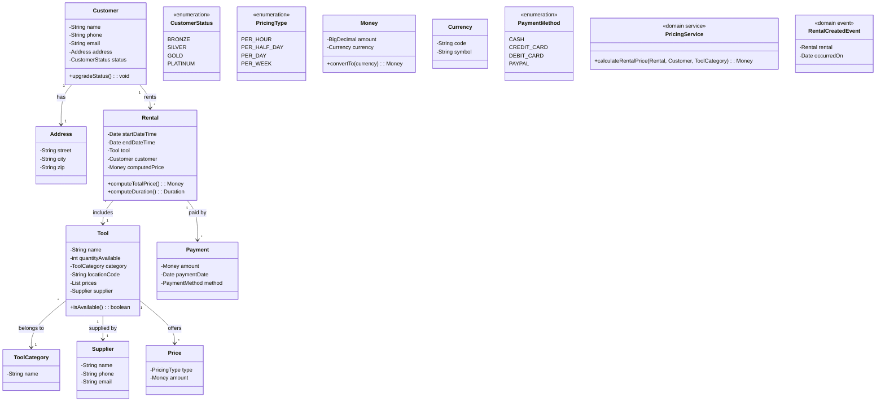
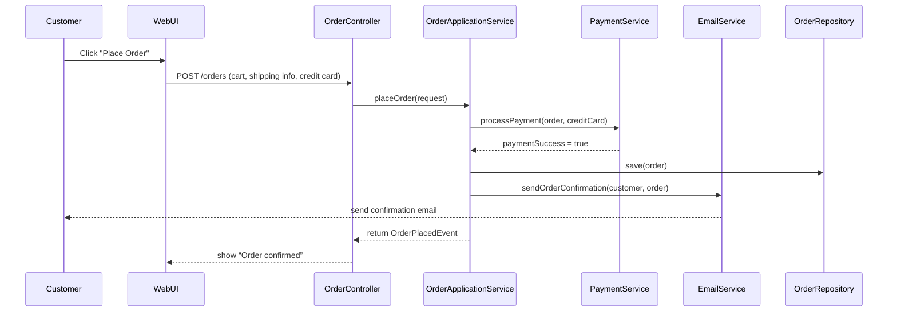
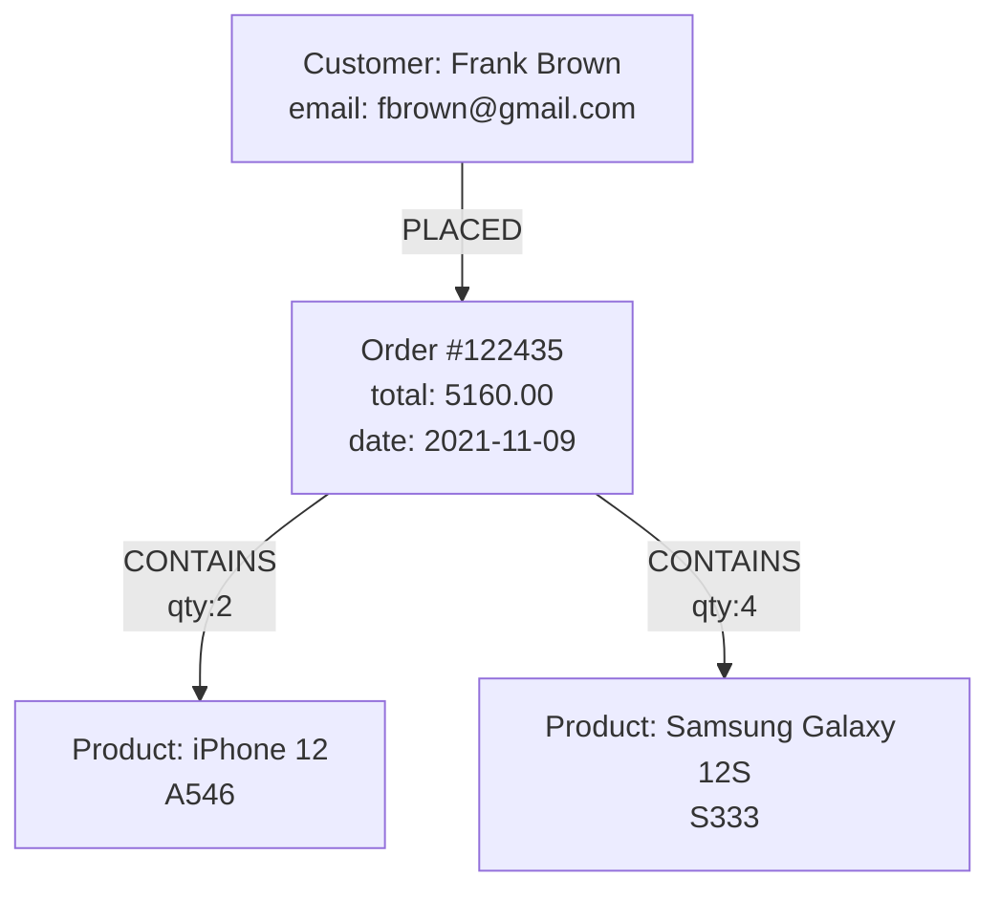

# Lab4

```flow
graph TD
  C[Customer: Frank Brown<br/>email: fbrown@gmail.com] -->|PLACED| O[Order #122435<br/>total: 5160.00<br/>date: 2021-11-09]
  O -->|CONTAINS<br/>qty:2| P1[Product: iPhone 12<br/>A546]
  O -->|CONTAINS<br/>qty:4| P2[Product: Samsung Galaxy 12S<br/>S333]

```



