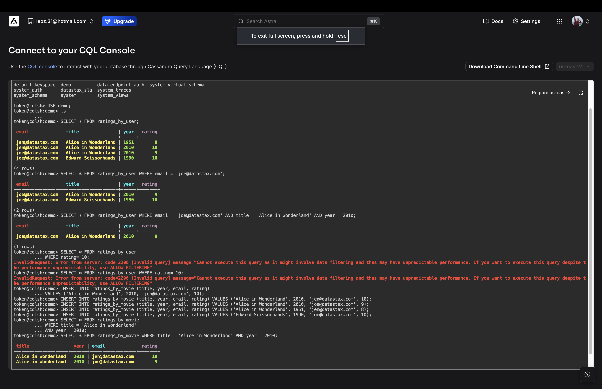
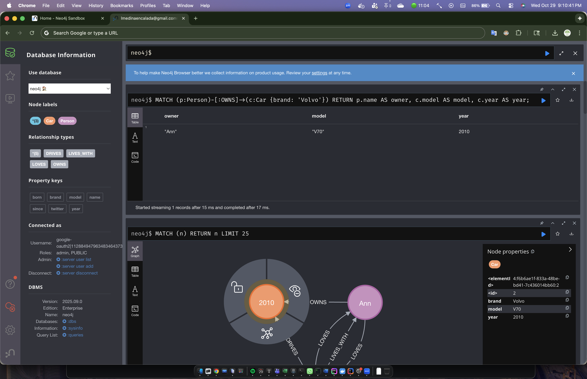
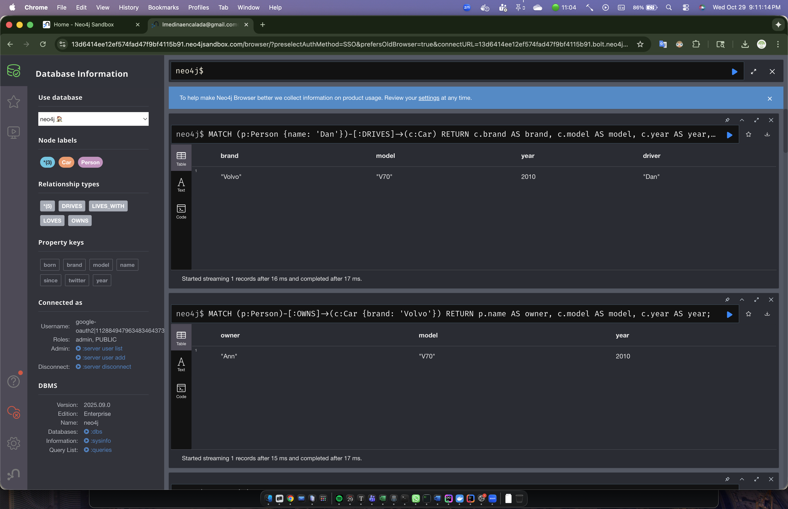
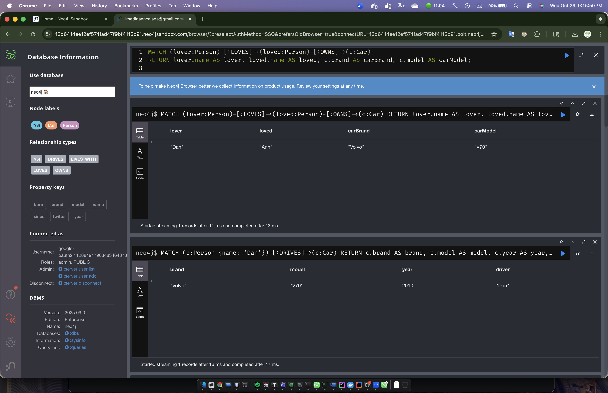
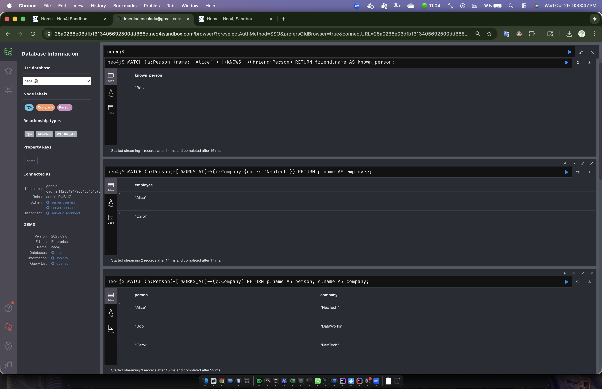

# LAB 3: DATA BASE

1. A zip file of part 1 **[ATTACHED](./part_1_Lesson3SpringMongoDemo.zip)**

2. A screenshot of part 2

   1. 

3. Multiple screenshots of part 3

   1. Find all persons who own a Volvo car

      

   2. Find the Car that is driven by Dan

      

   3. Find all persons who love someone that owns a car.

      

   4. Find who works at which company

   5. Find all people who work at NeoTech

   6. Find all people who Alice knows

      

      

4. A PDF of part 4 **[ATTACHED](./part_4.pdf)**

