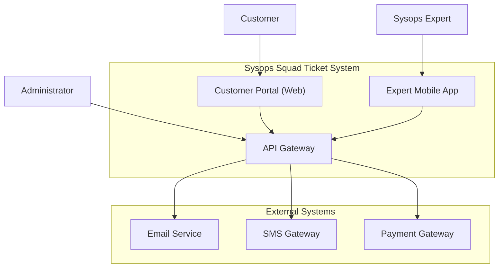
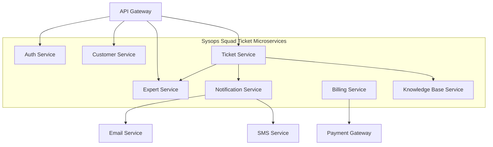
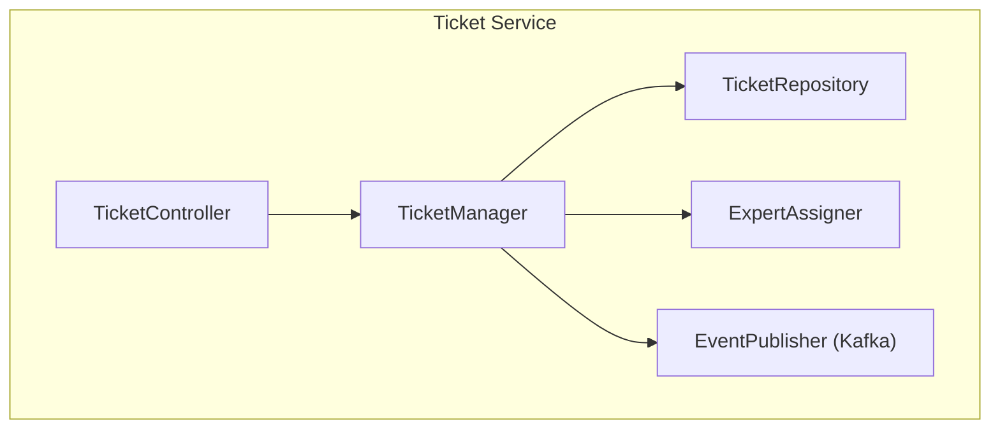
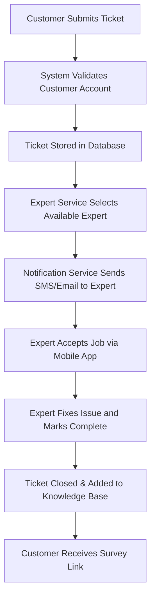
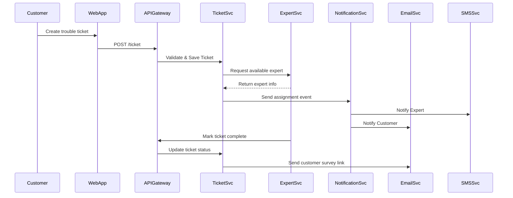
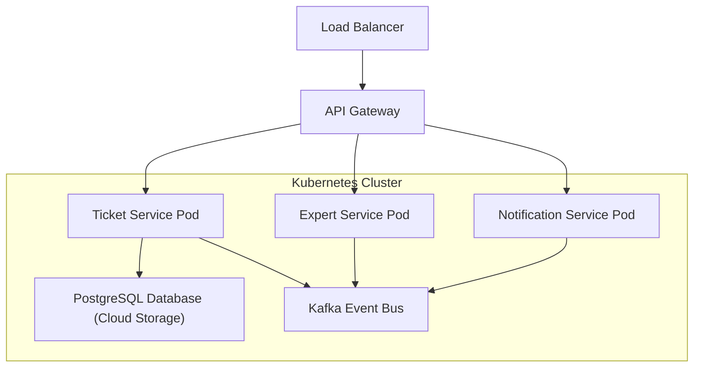

##  Lab 13 – Best Electronics Sysops Squad: New Ticket System Architecture

------

### **a. Architectural Characteristics**

| Category                            | Characteristic                                               | Description |
| ----------------------------------- | ------------------------------------------------------------ | ----------- |
| **Availability**                    | The system must be available 24/7 for customers and experts to submit and track tickets. |             |
| **Scalability**                     | The system must handle spikes in ticket volume and user access during high-demand periods. |             |
| **Reliability / Fault Tolerance**   | The system should continue operating even when one microservice or component fails. |             |
| **Performance**                     | Responses (ticket creation, assignment, updates) must happen within seconds. |             |
| **Modifiability / Maintainability** | The system should support frequent changes without affecting other components. |             |
| **Security**                        | Authentication and authorization for customers, experts, and admins; secure payments and personal data. |             |
| **Auditability**                    | All ticket updates, assignments, and billing transactions should be logged. |             |
| **Usability**                       | Web and mobile apps must be user-friendly for both customers and Sysops experts. |             |
| **Interoperability**                | Integration with SMS, email notification, and payment systems. |             |

------

### **b. Scenarios per Characteristic**

| Characteristic       | Scenario                                                     |
| -------------------- | ------------------------------------------------------------ |
| **Availability**     | If one microservice fails (e.g., Notification Service), others like Ticket or Expert Service should continue running; retry mechanism for notifications. |
| **Scalability**      | During a product recall, when thousands of customers submit tickets, the system auto-scales via container orchestration (Kubernetes). |
| **Reliability**      | When a database replica fails, the service continues using a secondary replica. |
| **Performance**      | Ticket assignment occurs within 2 seconds after a customer submits a request. |
| **Modifiability**    | A new “priority level” field can be added to tickets without redeploying all services. |
| **Security**         | Only registered customers can create tickets; only authorized experts can access them. |
| **Auditability**     | Admin can query the system to see which expert handled which ticket on which date. |
| **Usability**        | Experts access tickets easily via a responsive mobile app interface. |
| **Interoperability** | The system integrates seamlessly with Twilio (SMS) and Mailgun (email). |

------

### **c. Architecture Definition (Diagrams)**

------

#### **1. Context Diagram**

------

#### **2. Container Diagram**

------

#### **3. Component Diagram (for Ticket Service)**

------

#### **4. Activity Diagram (Ticket Lifecycle)**

------

#### **5. Sequence Diagram (End-to-End Ticket Flow)**

------

#### **6. Deployment Diagram (Optional – for completeness)**

------

### **d. Risks of the Proposed Architecture**

| Risk                        | Description                                                  | Impact                                                |
| --------------------------- | ------------------------------------------------------------ | ----------------------------------------------------- |
| **Integration Failure**     | Email/SMS/Payment services may be unavailable or slow.       | Missed notifications or delayed billing.              |
| **Data Inconsistency**      | Ticket or expert data may become inconsistent if services fail mid-transaction. | Wrong assignments or lost tickets.                    |
| **Performance Bottlenecks** | Improperly scaled Ticket Service could delay responses.      | Customer dissatisfaction.                             |
| **Security Breach**         | Unauthorized access or data leakage.                         | Legal and financial penalties.                        |
| **Complex Deployment**      | Microservices increase deployment complexity.                | DevOps overhead and potential downtime.               |
| **Message Loss in Queue**   | Kafka event loss or duplication.                             | Missed expert notifications or duplicate assignments. |

------

### **e. Risk Mitigation Options**

| Risk                        | Mitigation Strategy                                          |
| --------------------------- | ------------------------------------------------------------ |
| **Integration Failure**     | Implement retry policies, circuit breakers, and service fallback responses. |
| **Data Inconsistency**      | Use distributed transactions (Saga pattern) and event-driven consistency. |
| **Performance Bottlenecks** | Apply horizontal auto-scaling and caching layers (Redis).    |
| **Security Breach**         | Use OAuth2, JWT authentication, TLS encryption, and RBAC.    |
| **Complex Deployment**      | Automate CI/CD pipeline with Docker + Kubernetes + Helm charts. |
| **Message Loss**            | Enable Kafka message persistence, acknowledgments, and dead-letter queues. |

------

### ✅ **Summary**

The new **Sysops Squad Trouble Ticket System** adopts a **microservices architecture** that improves:

- **Availability** via independent scaling and fault tolerance.
- **Maintainability** by isolating services for tickets, experts, notifications, and billing.
- **Reliability** through asynchronous messaging (Kafka).
- **Security & Auditability** using centralized authentication, logging, and access control.

------

### **English Level**

**C1.**
 I use English daily to communicate with international teams across Ecuador, Chile, Peru, and Colombia, write documentation, review technical specifications, and participate in code reviews and sprint meetings with global engineering teams.

------

### **Fintech / Banking Experience**

Yes. I’ve worked in **banking and fintech** projects for institutions like **Banco Falabella**, **Banco Pichincha**, and **Banco Amazonas**. My main contributions include migrating core banking microservices to the cloud, developing **payment tokenization for Apple Pay and Mastercard**, and building debt refinancing and eCommerce platforms that improved customer experience and system performance.

------

### **Main Technical Challenges in Fintech Apps**

Building fintech applications requires strict **security, scalability, and compliance**. Key challenges include:

- Handling **real-time payments and transaction integrity**.
- Managing **secure tokenization and encryption** for sensitive data.
- Ensuring **high availability and regulatory compliance (PCI.)**.
- Balancing usability with strict authentication and authorization flows.

------

### **Frontend Experience**

I have about **4 years** of experience as a Frontend Developer, and around **3 years working specifically with React, Redux, and TypeScript** on large-scale web and banking platforms.

------

### **Most Recent React Project**

My latest React project was the **Banking Customer Service Portal** for Banco Falabella. I built the **UI for managing payment tokens** and card operations in real time. It was technically challenging due to its integration with multiple microservices, live transaction updates, and strict security validation on each user action.

------

### **Strongest Technical Areas**

I’m strongest in **frontend architecture, React ecosystem (React, Redux, TypeScript)**, and **integration with backend microservices**. I focus on performance optimization, responsive design, and delivering intuitive, secure user interfaces.

------

### **Other Frameworks / Libraries / Languages**

I’ve worked professionally with **Angular**, **Next.js**, **Node.js**, **NestJS**, and **Golang**. On the backend, I also use **Spring Boot** and **GraphQL** for API development.

------

### **Scalable or Complex Feature**

I’m proud of designing a **14-microservice architecture** for **uTransfer**, a serverless payment system on AWS. I optimized data flow between Lambda functions using SQS and SNS, which improved system reliability and scalability for high-volume money transfers.

------

### **Code Quality and Testing**

I ensure quality through **unit testing (Jest, Mocha, Chai)**, **code reviews**, and **static analysis tools like SonarQube**. I follow CI/CD best practices, enforce linting rules, and maintain clear, modular component structures for easy maintenance.

------

### **CI/CD and Cloud Deployments**

Yes. I’ve set up **CI/CD pipelines** using **GitLab Runner**, and deployed applications to **AWS (Lambda, EC2, S3)** and **Azure**. I’m experienced with containerization (Docker) and monitoring using **Kibana** and **Datadog**.

------

### **Availability**

I can join **immediately** or with a short notice period if needed.

------

### **Expected Compensation**

Open to discussion depending on the scope and responsibilities. My expected range is around **USD 6,000 – 7,000 per month** for a full-time remote position.