###  Lab 12 – Part 1: InterstateTrafficSensor

Somewhere on the interstate, two **traffic cameras** are installed **½ mile apart**. The maximum allowed speed on this interstate is **70 mph**.
 Each camera captures an image of every passing vehicle and extracts its **license plate** using built-in image recognition software.

Each camera produces a `SensorRecord` object:

```
public class SensorRecord {
    public String licencePlate;
    public int minute;
    public int second;
    public int cameraId;
}
```

Both cameras send their `SensorRecord` data to a **Kafka messaging system**:

- **Camera 1 → `cameratopic1`**
- **Camera 2 → `cameratopic2`**

The project **InterstateTrafficSensor** simulates both cameras. When it runs, it continuously publishes `SensorRecord` messages to Kafka.

------

### Diagram Description

The image above represents the extended event-driven architecture:

- **InterstateTrafficSensor**

  - Contains two physical sensors (`sensor1`, `sensor2`).
  - Each publishes `SensorRecord` messages to Kafka topics `cameratopic1` and `cameratopic2`.

- **InterstateSpeedService**

  - Consumes from both camera topics.

  - Calculates each car’s speed using the given formula:
    $$
    \text{speed (mph)} = \frac{0.5}{\text{time in seconds}} \times 3600
    $$

  - If the calculated speed > 72 mph, it creates a `SpeedRecord` and publishes it to the topic **`tofasttopic`**.

- **OwnerService**

  - Subscribes to `tofasttopic`.
  - Retrieves mock owner information for every license plate exceeding 72 mph.
  - Prints the owner’s name, address, and license plate to the console.
  - Publishes a `FeeRecord` to **`ownertopic`** containing the owner details and speed.

- **FeeCalculatorService** (optional extension)

  - Consumes from `ownertopic`.

  - Calculates the fine based on the following ranges:

    | Speed Range (mph) | Fee ($) |
    | ----------------- | ------- |
    | 72 – 77           | 25      |
    | 77 – 82           | 45      |
    | 82 – 90           | 80      |
    | > 90              | 125     |

  - Logs to the console the license plate, owner info, speed, and fee amount.

```mermaid
flowchart TD
    %% --- InterstateTrafficSensor ---
    subgraph ITS["🏗️ InterstateTrafficSensor"]
        S1["🟧 sensor1"]
        S2["🟧 sensor2"]
    end

    %% --- Kafka Topics Layer ---
    subgraph KafkaTopics["☁️ Kafka Messaging System"]
        CT1["📦 cameratopic1"]
        CT2["📦 cameratopic2"]
        TFT["📦 tofasttopic"]
        OT["📦 ownertopic"]
    end

    %% --- InterstateSpeedService ---
    subgraph ISS["🚗 InterstateSpeedService"]
        calc["🟧 speedProcessor"]
    end

    %% --- OwnerService ---
    subgraph OS["👤 OwnerService"]
        ownerProc["🟧 ownerLookup"]
    end

    %% --- FeeCalculatorService ---
    subgraph FCS["💰 FeeCalculatorService"]
        feeProc["🟧 feeCalculator"]
    end

    %% --- Data Flow ---
    S1 -- SensorRecord --> CT1
    S2 -- SensorRecord --> CT2

    CT1 -- consume --> calc
    CT2 -- consume --> calc
    calc -- SpeedRecord --> TFT

    TFT -- consume --> ownerProc
    ownerProc -- FeeRecord --> OT

    OT -- consume --> feeProc

```



