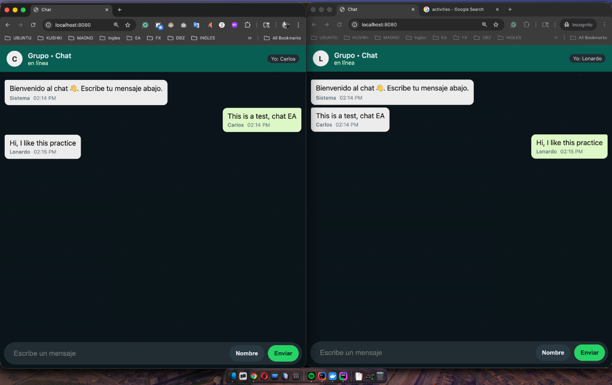
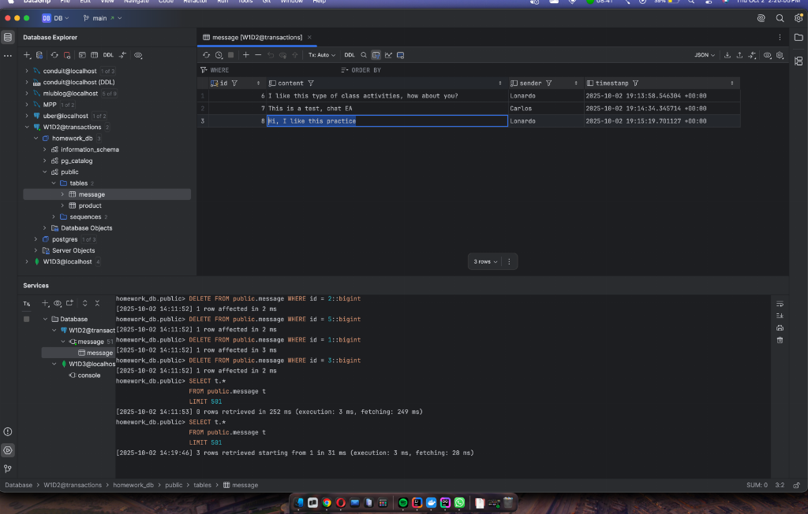

# Web Interface

## 6 Deliverable(s)

zip

Points Received:
**8** of 8

Deliverable Description:

### Lab Exercise: Real-time Messaging with Spring WebSockets and PostgreSQL

#### Objective

In this exercise, you will develop a small Spring Boot application that leverages WebSockets to enable real-time message exchange between clients. Each message sent will be persisted in a PostgreSQL database using JPA. You will set up the database, create a JPA entity class for Message, store each message, and broadcast new messages to all connected clients.

#### Technologies

- Java 21+
- Spring Boot 3.x
- Maven
- PostgreSQL (via Docker)
- Spring WebSockets
- Basic HTML/CSS/JS for client-side interaction

#### Setup Requirements

Before you begin, ensure you have:

- Java 21 JDK installed.
- Maven installed.
- Docker installed and running.

#### Exercise Steps

**Part 1: Database Setup with Docker**

1. Create a new directory for your project (e.g., `spring-websocket-postgresql`).
2. The PostgreSQL (pgvector) docker container may still be running (since we set it up in a previous exercise). See the previous exercise for instructions on how to start it, if it is no longer running.
   - There is no need to create a database, we'll configure JPA to create it.

**Part 2: Spring Boot Application - Core WebSocket**

1. Create a new Spring Boot project using Spring Initializr (start.spring.io) with the following dependencies:

   - Spring Web
   - Spring WebSocket (see exact dependency below)
   - Spring Data JPA
   - PostgreSQL Driver

2. Open your `pom.xml` and ensure you have at least these dependencies:

   

   ```xml
   <dependencies>
       <dependency>
           <groupId>org.springframework.boot</groupId>
           <artifactId>spring-boot-starter-web</artifactId>
       </dependency>
       <dependency>
           <groupId>org.springframework.boot</groupId>
           <artifactId>spring-boot-starter-websocket</artifactId>
       </dependency>
       <dependency>
           <groupId>org.springframework.boot</groupId>
           <artifactId>spring-boot-starter-data-jpa</artifactId>
       </dependency>
       <dependency>
           <groupId>org.postgresql</groupId>
           <artifactId>postgresql</artifactId>
           <scope>runtime</scope>
       </dependency>
   </dependencies>
   ```

3. Spring Initializr should have created a standard `App.java` annotated with `@SpringBootApplication` a `main` method.

   

   ```java
   package edu.miu.cs544;
   
   import org.springframework.boot.SpringApplication;
   import org.springframework.boot.autoconfigure.SpringBootApplication;
   
   @SpringBootApplication
   public class App {
       public static void main(String[] args) {
           SpringApplication.run(App.class, args);
       }
   }
   ```

4. Configure your `application.properties` (or `application.yml`) to connect to the PostgreSQL database:

   

   ```properties
   spring.datasource.url=jdbc:postgresql://localhost:5432/homework_db
   spring.datasource.username=postgres
   spring.datasource.password=postgres
   spring.jpa.hibernate.ddl-auto=update
   ```

5. Create a `Message` JPA entity class, and a `MessageRepository`:

   

   ```java
   package edu.miu.cs544;
   
   import jakarta.persistence.*;
   import java.time.OffsetDateTime;
   
   @Entity
   public final class Message {
       @Id
       @GeneratedValue(strategy = GenerationType.IDENTITY)
       private Long id;
   
       @Column(nullable = false, updatable = false)
       private String sender;
   
       @Column(nullable = false, updatable = false)
       private String content;
   
       @Column(updatable = false)
       private OffsetDateTime timestamp;
   
       public Message() {} // Default constructor required by JPA
   
       public Message(String sender, String content) {
           this.sender = sender;
           this.content = content;
           this.timestamp = OffsetDateTime.now();
       }
   
       // only getters, no setters (immutable after creation)
       public Long getId() { return id; }
       public String getSender() { return sender; }
       public String getContent() { return content; }
       public OffsetDateTime getTimestamp() { return timestamp; }
   
       @Override
       public String toString() {
           return "Message{" + "id=" + id + ", sender='" + sender + '\'' + ", content='" + content + '\'' + ", timestamp=" + timestamp + '}';
       }
   }
   ```

   

   ```java
   package edu.miu.cs544;
   
   import org.springframework.data.jpa.repository.JpaRepository;
   import org.springframework.stereotype.Repository;
   
   @Repository
   public interface MessageRepository extends JpaRepository<Message, Long> {}
   ```

6. Make a `MyWebSocketHandler.java` class to process incoming messages: (parse their JSON), store them into the database, and send them out to all connected sockets.

   

   ```java
   package edu.miu.cs544;
   
   import java.util.ArrayList;
   import java.util.List;
   
   import org.springframework.beans.factory.annotation.Autowired;
   import org.springframework.stereotype.Component;
   import org.springframework.web.socket.TextMessage;
   import org.springframework.web.socket.WebSocketSession;
   import org.springframework.web.socket.handler.TextWebSocketHandler;
   
   import com.fasterxml.jackson.databind.JsonNode;
   import com.fasterxml.jackson.databind.ObjectMapper;
   
   @Component
   public class MyWebSocketHandler extends TextWebSocketHandler {
       private List<WebSocketSession> sessions = new ArrayList<>();
   
       @Autowired
       private MessageRepository messageRepository;
   
       @Autowired
       private ObjectMapper objectMapper;
   
       @Override
       public void handleTextMessage(WebSocketSession session, TextMessage message) throws Exception {
           // Log the received message
           System.out.println("Received message: " + message.getPayload());
   
           // Parse the incoming JSON message
           JsonNode jsonNode = objectMapper.readTree(message.getPayload());
           String sender = jsonNode.get("sender").asText();
           String content = jsonNode.get("content").asText();
   
           // Save the message to the database
           messageRepository.save(new Message(sender, content));
   
           // Broadcast the message to all connected clients
           for (WebSocketSession s : sessions) {
               if (s.isOpen()) {
                   s.sendMessage(message);
               }
           }
       }
   
       @Override
       public void afterConnectionEstablished(WebSocketSession session) throws Exception {
           sessions.add(session);
           System.out.println("New connection established: " + session.getId());
       }
   
       @Override
       public void afterConnectionClosed(WebSocketSession session, org.springframework.web.socket.CloseStatus status) throws Exception {
           sessions.remove(session);
           System.out.println("Connection closed: " + session.getId());
       }
   }
   ```

7. Create a `WebSocketConfig.java` class to connect your WebSocket handler:

   

   ```java
   package edu.miu.cs544;
   
   import org.springframework.beans.factory.annotation.Autowired;
   import org.springframework.context.annotation.Configuration;
   import org.springframework.web.socket.config.annotation.EnableWebSocket;
   import org.springframework.web.socket.config.annotation.WebSocketConfigurer;
   import org.springframework.web.socket.config.annotation.WebSocketHandlerRegistry;
   
   @Configuration
   @EnableWebSocket
   public class WebSocketConfig implements WebSocketConfigurer {
       @Autowired
       private MyWebSocketHandler myWebSocketHandler;
   
       @Override
       public void registerWebSocketHandlers(WebSocketHandlerRegistry registry) {
           registry.addHandler(myWebSocketHandler, "/chat").setAllowedOrigins("*");
       }
   }
   ```

**Part 3: Simple Frontend**

1. Create a `static` directory in `src/main/resources`.

2. Inside `src/main/resources/static`, create an `index.html` file:

   

   ```html
   <!DOCTYPE html>
   <html lang="en">
   <head>
   <meta charset="UTF-8">
   <title>Spring WebSocket Chat</title>
   <style>
       body { font-family: Arial, sans-serif; margin: 20px; }
       #chat-container { width: calc(100% - 25px); border: 1px solid #ccc; padding: 10px; height: 80vh; min-height: 200px; margin: 5px 0px; overflow-y: scroll; }
       #username-input { width: 100px; padding: 5px; }
       #message-input { width: calc(100% - 200px); padding: 5px; }
       #send-button { width: 60px; padding: 5px; }
       .message { margin-bottom: 5px; display: flex; }
       .sender { font-weight: bold; width: 100px; text-align: right; margin-right: 10px; }
   </style>
   </head>
   <body>
   <h1>Spring WebSocket Chat</h1>
   
   <div id="connection-status">Connecting...</div>
   <div id="chat-container"></div>
   <input type="text" id="username-input" placeholder="Your name" value="Anon">
   <input type="text" id="message-input" placeholder="Type a message...">
   <button id="send-button">Send</button>
   
   <script>
       const connectionStatus = document.getElementById('connection-status');
       const chatContainer = document.getElementById('chat-container');
       const usernameInput = document.getElementById('username-input');
       const messageInput = document.getElementById('message-input');
       const sendButton = document.getElementById('send-button');
   
       let webSocket;
   
       function connect() {
           webSocket = new WebSocket('ws://' + window.location.host + '/chat');
   
           webSocket.onopen = function() {
               connectionStatus.innerText = 'Connected!';
           };
   
           webSocket.onmessage = function(event) {
               displayMessage(event.data);
           };
   
           webSocket.onerror = function(error) {
               connectionStatus.innerText = 'WebSocket error: ' + error;
               console.error('WebSocket Error: ', error);
           };
   
           webSocket.onclose = function() {
               connectionStatus.innerText = 'Disconnected. Please refresh the page to reconnect.';
           };
       }
   
       function sendMessage() {
           const messageContent = messageInput.value.trim();
           const username = usernameInput.value.trim() || 'Anon';
   
           if (messageContent && webSocket && webSocket.readyState === WebSocket.OPEN) {
               const chatMessage = {
                   sender: username,
                   content: messageContent
               };
               webSocket.send(JSON.stringify(chatMessage));
               messageInput.value = ''; // Clear input
           }
       }
   
       function displayMessage(messageData) {
           const message = JSON.parse(messageData);
           const messageElement = document.createElement('div');
           messageElement.classList.add('message');
   
           const senderElement = document.createElement('span');
           senderElement.classList.add('sender');
           senderElement.textContent = message.sender + ': ';
   
           const contentElement = document.createElement('span');
           contentElement.textContent = message.content;
   
           messageElement.appendChild(senderElement);
           messageElement.appendChild(contentElement);
           chatContainer.appendChild(messageElement);
           chatContainer.scrollTop = chatContainer.scrollHeight; // Scroll to bottom
       }
   
       document.addEventListener('DOMContentLoaded', function() {
           sendButton.addEventListener('click', sendMessage);
           messageInput.addEventListener('keypress', function(event) {
               if (event.key === 'Enter') {
                   sendMessage();
               }
           });
           connect();
       });
   </script>
   </body>
   </html>
   ```

**Part 4: Run and Verify**

1. Run your Spring Boot application (e.g., `./mvnw spring-boot:run`).
2. Open `http://localhost:8080` in your web browser.
3. Open a second browser tab (or incognito window) to `http://localhost:8080`.
4. Type messages in both windows. Verify that messages appear in real-time in both clients. Take a **screenshot** and submit this as the next deliverable.
5. Check your database `message` table to ensure messages are being persisted. Take another **screenshot** to submit as the deliverable.

### Deliverables

Compress your entire Spring Boot project directory (including `src`, `pom.xml`, etc.) into a single `.zip` file. Before zipping, make sure to delete the `target` directory and create a `README.md` file that explains how to run the project, including any setup instructions.

The screenshots you took will need to be uploaded as the next two deliverables.

### Grading (10 points)

- **2 points:** PostgreSQL container successfully starts using the provided Docker command, and the `messages` table is created in the database.
- **2 points:** Spring Boot application successfully starts and connects to the PostgreSQL database.
- **3 points:** Spring WebSockets are correctly configured (`WebSocketConfig`) and a `MyWebSocketHandler` handles incoming messages.
- **2 points:** `MessageRepository` correctly persists `Message` entities into the `messages` table.
- **1 point:** The `index.html` frontend successfully connects to the WebSocket endpoint, sends messages, and displays received messages in real-time.

Your Submission:

Hours: 00:00 Complete: 0%

[websockets.zip](https://manalabs.org/videos/cs544/2025-10/lab/164/res/course/cs544/2025-10/lab/164/01/submit/1676/2025-10-02_19:21:57_678_websockets.zip)

```
945.84 KB
websockets/2025-10-02 21:18:54
websockets/img_1.png2025-10-02 16:20:10
websockets/mvnw.cmd2025-10-02 15:38:34
websockets/img.png2025-10-02 16:15:48
websockets/pom.xml2025-10-02 15:38:34
websockets/HELP.md2025-10-02 15:38:34
websockets/README.md2025-10-02 21:18:54
websockets/.gitignore2025-10-02 15:43:34
websockets/.mvn/2025-10-02 15:38:34
websockets/.gitattributes2025-10-02 15:38:34
websockets/mvnw2025-10-02 15:38:34
websockets/.idea/2025-10-02 21:19:00
websockets/src/2025-10-02 15:38:34
websockets/.mvn/wrapper/2025-10-02 15:38:34
websockets/.idea/encodings.xml2025-10-02 15:51:10
websockets/.idea/jarRepositories.xml2025-10-02 15:51:10
websockets/.idea/vcs.xml2025-10-02 15:51:10
websockets/.idea/.gitignore2025-10-02 15:39:46
websockets/.idea/workspace.xml2025-10-02 21:19:00
websockets/.idea/misc.xml2025-10-02 15:51:10
websockets/.idea/compiler.xml2025-10-02 15:51:10
websockets/src/test/2025-10-02 15:38:34
websockets/src/main/2025-10-02 15:38:34
websockets/.mvn/wrapper/maven-wrapper.properties2025-10-02 15:38:34
websockets/src/test/java/2025-10-02 15:38:34
websockets/src/main/resources/2025-10-02 15:41:32
websockets/src/main/java/2025-10-02 15:38:34
websockets/src/test/java/W1D4/2025-10-02 15:38:34
websockets/src/main/resources/static/2025-10-02 16:05:38
websockets/src/main/resources/templates/2025-10-02 15:38:34
websockets/src/main/resources/application.properties2025-10-02 15:41:32
websockets/src/main/java/W1D4/2025-10-02 15:38:34
websockets/src/test/java/W1D4/websockets/2025-10-02 15:38:34
websockets/src/main/resources/static/index.html2025-10-02 16:05:38
websockets/src/main/java/W1D4/websockets/2025-10-02 15:44:40
websockets/src/test/java/W1D4/websockets/WebsocketsApplicationTests.java2025-10-02 15:38:34
websockets/src/main/java/W1D4/websockets/sockets/2025-10-02 15:46:36
websockets/src/main/java/W1D4/websockets/WebsocketsApplication.java2025-10-02 15:38:34
websockets/src/main/java/W1D4/websockets/service/2025-10-02 15:44:06
websockets/src/main/java/W1D4/websockets/domain/2025-10-02 15:42:40
websockets/src/main/java/W1D4/websockets/sockets/MyWebSocketHandler.java2025-10-02 15:45:52
websockets/src/main/java/W1D4/websockets/sockets/WebSocketConfig.java2025-10-02 15:46:36
websockets/src/main/java/W1D4/websockets/service/MessageRepository.java2025-10-02 15:44:06
websockets/src/main/java/W1D4/websockets/domain/Message.java2025-10-02 15:42:40
```

Grading Comment:

```
This is great Leonardo, I love the fact that you further upgraded the HTML and CSS!
```

img

Points Received:
**1** of 1

Deliverable Description:

Screenshot of your chat working (sending and receiving messages)

Your Submission:

Hours: 00:00 Complete: 0%

[img.png](https://manalabs.org/videos/cs544/2025-10/lab/164/res/course/cs544/2025-10/lab/164/02/submit//2025-10-02_14:23:07_678.png)

Grading Comment:

```
Excellent!
```

img

Points Received:
**1** of 1

Deliverable Description:

Screenshot of the chat messages in the database

Your Submission:

Hours: 00:00 Complete: 0%

[img_1.png](https://manalabs.org/videos/cs544/2025-10/lab/164/res/course/cs544/2025-10/lab/164/03/submit//2025-10-02_14:23:16_678.png)

zip

Points Received:
**3** of 3

Deliverable Description:

### Lab Exercise: Building a GraphQL Service for Messages

#### Objective

In this lab, you will create a Java Spring Boot application that exposes a simple `Message` entity via a GraphQL service. This service will allow users to query existing messages and add new ones, interacting with a PostgreSQL database.

#### Prerequisites

- Java Development Kit (JDK) 21 or higher.
- Maven as build tool.
- An IDE (e.g., IntelliJ IDEA, VS Code).
- Basic familiarity with Spring Boot, Spring Data JPA, and PostgreSQL.
- Access to a running PostgreSQL database (a Docker container running on `localhost:5432` is assumed).

#### Instructions

1. **Project Setup**

   - Create a new Spring Boot project using Spring Initializr [start.spring.io](https://start.spring.io/).
   - **Dependencies:** `Spring Web`, `Spring Data JPA`, `Spring for GraphQL`, `PostgreSQL Driver`.
   - Choose Java 21+ and Maven as your build tool.

2. **Database Setup**

   - Ensure your PostgreSQL instance is running (see previous assignment for setup, to check if it's running execute: `docker ps`).
   - You should already have a `message` table in the `homework_db` from the previous exercise. If not have it yet, JPA should create it when the application starts.

3. **Spring Boot Configuration**

   - Configure your `application.properties` (or `application.yml`) to connect to your PostgreSQL database. Example:

     

     ```properties
     spring.datasource.url=jdbc:postgresql://localhost:5432/homework_db
     spring.datasource.username=postgres
     spring.datasource.password=postgres
     
     # Or 'none' if you prefer manual table management
     spring.jpa.hibernate.ddl-auto=update 
     spring.jpa.show-sql=true
     
     # to be able to use the GraphiQL interface
     spring.graphql.graphiql.enabled=true
     ```

4. **JPA Entity and Repository**

   - Create a `Message` JPA entity in your project (or copy it from the previous exercise)

     

     ```java
     package edu.miu.cs544;
     
     import jakarta.persistence.*;
     import java.time.OffsetDateTime;
     
     @Entity
     public final class Message {
         @Id
         @GeneratedValue(strategy = GenerationType.IDENTITY)
         private Long id;
     
         @Column(nullable = false, updatable = false)
         private String sender;
     
         @Column(nullable = false, updatable = false)
         private String content;
     
         @Column(updatable = false)
         private OffsetDateTime timestamp;
     
         public Message() {} // Default constructor required by JPA
     
         public Message(String sender, String content) {
             this.sender = sender;
             this.content = content;
             this.timestamp = OffsetDateTime.now();
         }
     
         // only getters, no setters (immutable after creation)
         public Long getId() { return id; }
         public String getSender() { return sender; }
         public String getContent() { return content; }
         public OffsetDateTime getTimestamp() { return timestamp; }
     
         @Override
         public String toString() {
             return "Message{" + "id=" + id + ", sender='" + sender + '\'' + ", content='" + content + '\'' + ", timestamp=" + timestamp + '}';
         }
     }
     ```

   - Create a Spring Data JPA `MessageRepository` interface (or again copy it from the previous exercise).

5. **GraphQL Schema Definition**

   - In the `src/main/resources/graphql` directory (create it if it doesn't exist), create a file named `schema.graphqls`.

   - Define your GraphQL types, queries, and mutations (note the `timestamp` field):

     

     ```graphql
     type Message {
         id: ID!
         sender: String!
         content: String!
         timestamp: String # Represent OffsetDateTime as String
     }
     
     type Query {
         messages: [Message!]
         messageById(id: ID!): Message
     }
     
     type Mutation {
         createMessage(content: String!, sender: String!): Message!
     }
     ```

6. **GraphQL Controller/Resolvers**

   - Create a Spring `@Controller` class (e.g., `MessageController`). This lab assumes that we'll put everything into one controller, but if you want you can also create a `MessageQuery` controller and `MessagaMutation` controller.
   - Inject your `MessageRepository` into this controller.
   - Use `@QueryMapping` and `@MutationMapping`) annotations to map your GraphQL queries and mutations to methods.
   - Implement the following methods:
     - A method for `messages` that returns all messages from the repository.
     - A method for `messageById(id: ID!)` that retrieves a message by its ID. Handle cases where the message is not found (e.g., return `null`).
     - A method for `createMessage(content: String!, sender: String!)` that creates a new `Message` entity and saves it using the repository, and returns the saved message.

7. **Test Your Service with GraphiQL**

   - Run your Spring Boot application.

   - Access the GraphiQL interface (typically at `http://localhost:8080/graphiql`).

   - Perform some test queries and mutations (note the `timestamp` field in selections):

     ```graphql
     # Query all messages
     query {
       messages {
         id
         sender
         content
         timestamp
       }
     }
     ```

     

     ```graphql
     # Create a message
     mutation {
       createMessage(content: "Hello GraphQL!", sender: "Alice") {
         id
         sender
         content
         timestamp
       }
     }
     ```

     

     ```graphql
     # Query by ID (replace with an actual ID from your data)
     query {
       messageById(id: "1") {
         id
         sender
         content
         timestamp
       }
     }
     ```

   - Make a **screenshot** of the list of all messages to submit as a deliverable

8. **Test Your Service with REST**

   - Make sure your Spring Boot application is still running

   - Get a list of all messages through the REST endpoint at `http://localhost:8080/graphql`

   - As always you can use any REST client. I've provided a curl example below.

     ```bash
     curl -X POST \
     http://localhost:8080/graphql \
     -H 'Content-Type: application/json' \
     -d '{
     "query": "query { messages { id sender content timestamp } }"
     }'
     ```

   - Also make a **screenshot** of this and submit it as one of the next deliverables

### Deliverable

Remember to delete the target directory, and submit a single `.zip` file containing your complete Spring Boot project. Ensure the project is runnable and contains a README.md that describes how to run it.

You'll submit the **screenshots** as the next two deliverables.

### Grading Criteria

This exercise will be graded out of 5 points based on the following:

- **1 point:** **Database Connectivity:** Application successfully connects to the PostgreSQL database as configured.
- **1 point:** **GraphQL Schema (`schema.graphqls`):** Correct definition of `Message` type (including `id`, `sender`, `content`, and `timestamp`), `Query` type with `messages` and `messageById`, and `Mutation` type with `createMessage`.
- **1 point:** **GraphQL Controller:** Correct implementation of GraphQL data fetchers in the controller for all defined queries and mutations (`messages`, `messageById`, `createMessage`), properly handling the `timestamp` field on creation.
- **2 points:** **Functionality and Testability:** The application runs without errors and the GraphQL endpoints function correctly (can create, retrieve all, and retrieve by ID messages via GraphiQL).

Your Submission:

Hours: 00:00 Complete: 0%

[graphql.zip](https://manalabs.org/videos/cs544/2025-10/lab/164/res/course/cs544/2025-10/lab/164/04/submit/1676/2025-10-02_19:16:55_678_graphql.zip)

```
534.36 KB
graphql/2025-10-02 21:16:34
graphql/img_1.png2025-10-02 21:12:00
graphql/mvnw.cmd2025-10-02 16:40:44
graphql/img.png2025-10-02 21:10:06
graphql/pom.xml2025-10-02 16:40:44
graphql/HELP.md2025-10-02 16:40:44
graphql/README.md2025-10-02 21:09:12
graphql/.gitignore2025-10-02 16:40:44
graphql/.mvn/2025-10-02 16:40:44
graphql/.gitattributes2025-10-02 16:40:44
graphql/mvnw2025-10-02 16:40:44
graphql/.idea/2025-10-02 21:12:04
graphql/src/2025-10-02 16:40:44
graphql/.mvn/wrapper/2025-10-02 16:40:44
graphql/.idea/encodings.xml2025-10-02 16:44:36
graphql/.idea/jarRepositories.xml2025-10-02 16:44:36
graphql/.idea/vcs.xml2025-10-02 16:44:36
graphql/.idea/.gitignore2025-10-02 16:44:34
graphql/.idea/workspace.xml2025-10-02 21:12:04
graphql/.idea/misc.xml2025-10-02 16:44:36
graphql/.idea/compiler.xml2025-10-02 16:44:36
graphql/src/test/2025-10-02 16:40:44
graphql/src/main/2025-10-02 16:40:44
graphql/.mvn/wrapper/maven-wrapper.properties2025-10-02 16:40:44
graphql/src/test/java/2025-10-02 16:40:44
graphql/src/main/resources/2025-10-02 17:22:48
graphql/src/main/java/2025-10-02 16:40:44
graphql/src/test/java/edu/2025-10-02 16:40:44
graphql/src/main/resources/graphql/2025-10-02 20:34:52
graphql/src/main/resources/static/2025-10-02 16:40:44
graphql/src/main/resources/templates/2025-10-02 16:40:44
graphql/src/main/resources/application.properties2025-10-02 17:22:48
graphql/src/main/java/edu/2025-10-02 16:40:44
graphql/src/test/java/edu/miu/2025-10-02 16:40:44
graphql/src/main/resources/graphql/schema.graphqls2025-10-02 20:34:52
graphql/src/main/java/edu/miu/2025-10-02 16:40:44
graphql/src/test/java/edu/miu/cs44/2025-10-02 16:40:44
graphql/src/main/java/edu/miu/cs44/2025-10-02 16:40:44
graphql/src/test/java/edu/miu/cs44/graphql/2025-10-02 16:40:44
graphql/src/main/java/edu/miu/cs44/graphql/2025-10-02 20:34:16
graphql/src/test/java/edu/miu/cs44/graphql/GraphqlApplicationTests.java2025-10-02 16:40:44
graphql/src/main/java/edu/miu/cs44/graphql/controller/2025-10-02 20:35:40
graphql/src/main/java/edu/miu/cs44/graphql/GraphqlApplication.java2025-10-02 16:40:44
graphql/src/main/java/edu/miu/cs44/graphql/service/2025-10-02 20:34:36
graphql/src/main/java/edu/miu/cs44/graphql/domain/2025-10-02 17:23:28
graphql/src/main/java/edu/miu/cs44/graphql/controller/MessageController.java2025-10-02 20:35:40
graphql/src/main/java/edu/miu/cs44/graphql/service/MessageRepository.java2025-10-02 20:34:36
graphql/src/main/java/edu/miu/cs44/graphql/domain/Message.java2025-10-02 17:23:28
```

img

Points Received:
**1** of 1

Deliverable Description:

Screenshot of a list of all messages in GraphiQL

Your Submission:

Hours: 00:00 Complete: 0%

[img.png](https://manalabs.org/videos/cs544/2025-10/lab/164/res/course/cs544/2025-10/lab/164/05/submit//2025-10-02_19:14:36_678.png)

img

Points Received:
**1** of 1

Deliverable Description:

Screenshot of a list of all messages through the REST endpoint

Your Submission:

Hours: 00:00 Complete: 0%

[img_1.png](https://manalabs.org/videos/cs544/2025-10/lab/164/res/course/cs544/2025-10/lab/164/06/submit//2025-10-02_19:14:21_678.png)