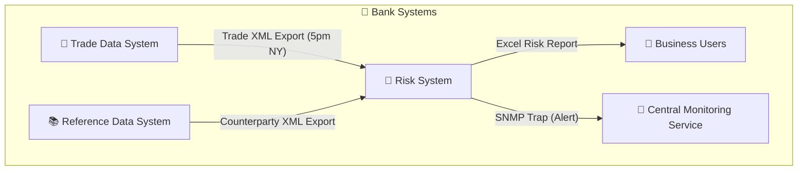
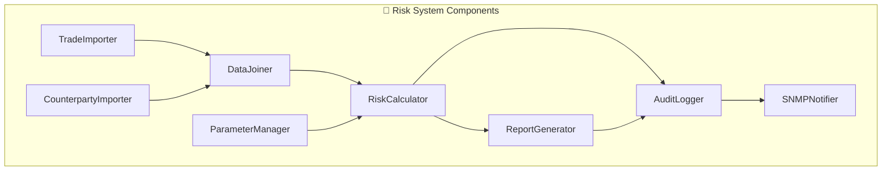
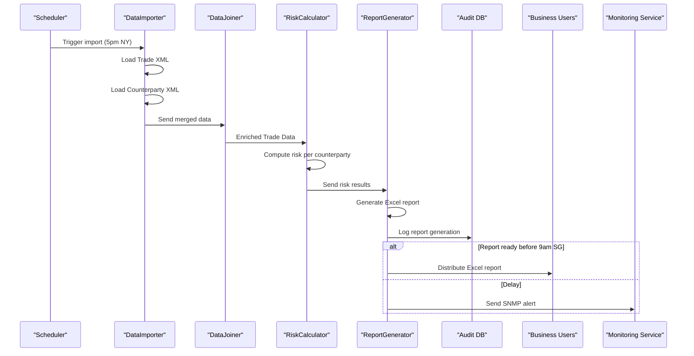

## a. Use Case Diagram

```mermaid
graph TD
    actor BusinessUser as "👩‍💼 Business User"
    actor RiskManager as "👨‍💻 Risk Manager"
    actor Admin as "🛠️ System Administrator"
    actor MonitoringService as "📡 Central Monitoring Service"

    subgraph RiskSystem["🧮 Financial Risk System"]
        UC1["Import Trade Data"]
        UC2["Import Counterparty Data"]
        UC3["Join & Enrich Data"]
        UC4["Calculate Risk Exposure"]
        UC5["Generate Risk Report"]
        UC6["Distribute Report"]
        UC7["Configure Risk Parameters"]
        UC8["Log & Audit Events"]
        UC9["Send SNMP Alerts"]
    end

    BusinessUser --> UC5
    BusinessUser --> UC6
    RiskManager --> UC7
    Admin --> UC8
    MonitoringService --> UC9
    UC1 --> UC3
    UC2 --> UC3
    UC3 --> UC4
    UC4 --> UC5
    UC5 --> UC6
```

------

## 🔄 b. Activity Diagram – Creating a Risk Report

```
flowchart TD
    A["Start of Process (5pm NY)"] --> B["Import Trade Data (TDS XML)"]
    B --> C["Import Counterparty Data (RDS XML)"]
    C --> D["Join Data: Enrich Trades with Counterparty Info"]
    D --> E["Run Risk Calculations per Counterparty"]
    E --> F["Generate Risk Report (Excel Format)"]
    F --> G{"Report Generated Before 9am Singapore?"}
    G -- Yes --> H["Distribute Report to Authorized Users"]
    G -- No --> I["Send SNMP Alert to Monitoring Service"]
    H --> J["Log Report Generation in Audit System"]
    I --> J
    J --> K["End of Process"]
```

------

## 🌐 c. Context Diagram



------

## 🧱 d. Container Diagram

```
graph TD
    subgraph RiskSystem["🧮 Financial Risk System"]
        API["REST API / Web UI"]
        Scheduler["Batch Scheduler"]
        Importer["Data Importer"]
        Processor["Risk Calculation Engine"]
        Repo["Audit & Parameter Database"]
        Reporter["Excel Report Generator"]
    end

    TDS["💾 Trade Data System"] --> Importer
    RDS["📚 Reference Data System"] --> Importer
    Importer --> Processor
    Processor --> Reporter
    Reporter --> API
    API --> Users["👩‍💼 Business Users"]
    Processor --> Repo
    API --> Repo
```

------

## ⚙️ e. Component Diagram



------

## 🧭 f. Sequence Diagram – Risk Report Generation

