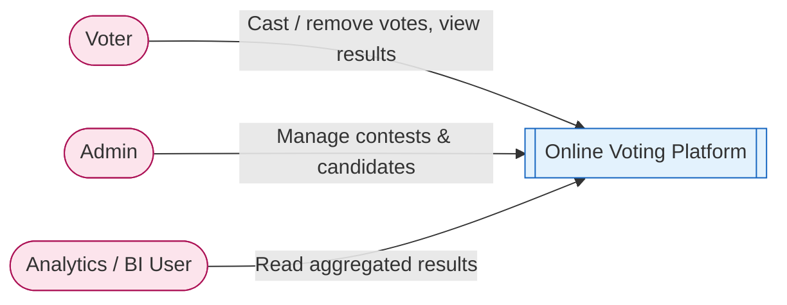
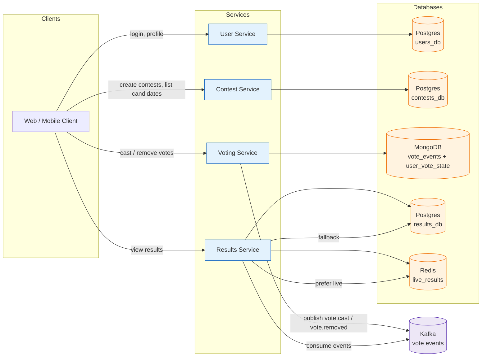
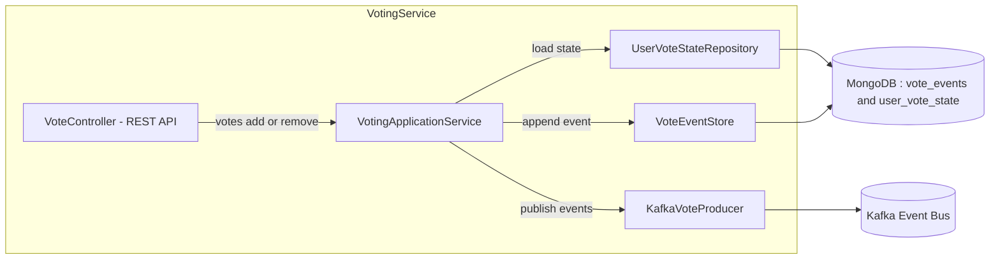
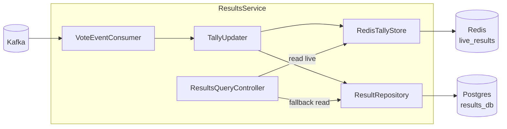
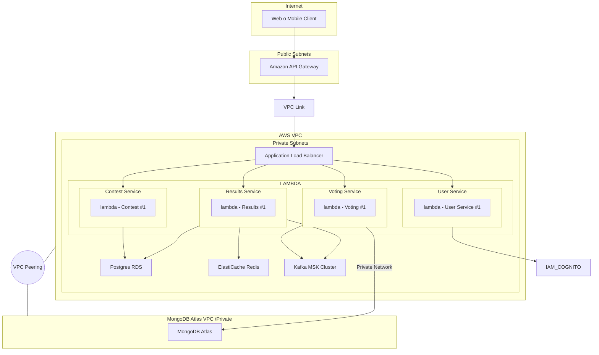
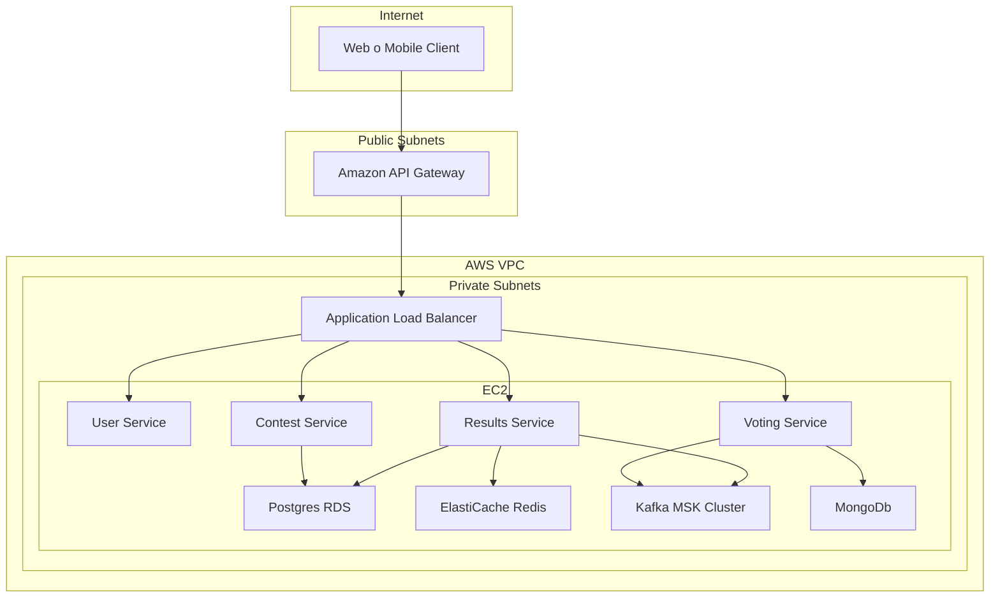
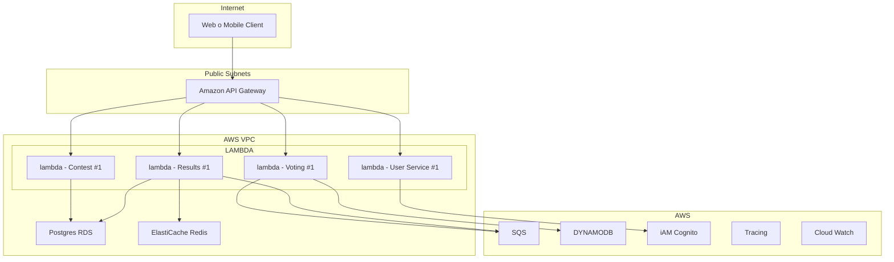
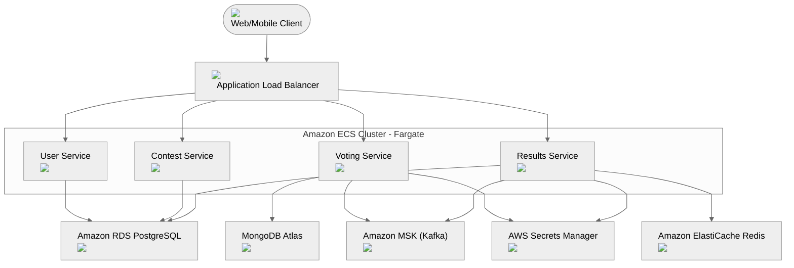

# 1) Mapping course components → AWS services (refined)

- **Registry (service discovery)**
   Us4
-  for service discovery (DNS and HTTP-based u + health checks). It maps well to Consul’s basic discovery features. [Amazon Web Services, Inc.](https://aws.amazon.com/blogs/containers/getting-started-with-app-mesh-and-eks/?utm_source=chatgpt.com)
- **Load balancing**
   Use **Application Load Balancer (ALB)** for HTTP(s) traffic and ALB Target Groups for routing to pods/tasks. ALB integrates with EKS (ALB Ingress Controller) or with ECS.
- **API Gateway**
   Use **Amazon API Gateway** as the external API “front door” when you need API features such as rate-limiting, API keys, usage plans and fine-grained request mapping. For simple HTTP ingress you can also use ALB.
- **Distributed tracing**
   Use **AWS X-Ray** for traces and service maps — it integrates with EC2, ECS/Fargate, EKS and Lambda. Instrument Spring Boot apps with the X-Ray SDK or export OpenTelemetry to X-Ray. [AWS Documentation+1](https://docs.aws.amazon.com/app-mesh/latest/userguide/getting-started-kubernetes.html?utm_source=chatgpt.com)
- **Logging / observability**
   Use **CloudWatch Logs** and **CloudWatch Metrics** for central logging and metrics. For advanced search/visualization use **Amazon OpenSearch** or Grafana connected to CloudWatch.
- **Resilience (circuit breaker)**
   Implement circuit breakers inside the services using **Resilience4j** or **Spring Cloud Circuit Breaker** (that keeps behavior consistent with your on-prem code).
   Optionally use **AWS App Mesh** (Envoy sidecars) to centralize network-level controls (retries, timeouts, traffic shifting) and to improve observability; note that App Mesh *does not replace* in-app circuit breaker libraries — it complements them by handling network policies and telemetry. (App Mesh injects sidecars via the App Mesh controller for Kubernetes). [AWS Documentation+1](https://docs.aws.amazon.com/app-mesh/latest/userguide/getting-started-kubernetes.html?utm_source=chatgpt.com)
- **Config server**
   Use **AWS Systems Manager Parameter Store** and **AWS AppConfig** for runtime configuration; use **Secrets Manager** for secrets. You can continue to use **Spring Cloud Config** backed by S3 or Parameter Store if you want drop-in compatibility.
- **Security / Authentication & Authorization**
   For managed auth, use **Amazon Cognito** (user pools, OIDC). If you require full Keycloak features (custom flows, complex identity federation) you may run **Keycloak** in the cluster (EKS) or EC2.
   For pod-level AWS permissions (access to S3, SQS, etc.) use **IAM Roles for Service Accounts (IRSA)** — EKS uses an OIDC provider so individual Kubernetes ServiceAccounts can assume least-privilege IAM roles. Also use TLS between services (mTLS via App Mesh optional) and enforce IAM for AWS API calls. [AWS Documentation+1](https://docs.aws.amazon.com/eks/latest/userguide/iam-roles-for-service-accounts.html?utm_source=chatgpt.com)
- **REST & Messaging**
  - Keep REST as HTTP between services.
  - For Kafka compatibility: use **Amazon MSK (Managed Streaming for Kafka)** — it preserves Kafka semantics (retention, replay, partitions, offsets). MSK retains messages for a configurable retention period, enabling replay.
  - If you can move to simpler queueing semantics, **SQS** (queues) and **SNS** (pub/sub notifications) are lower operational overhead but behave differently (SQS is a queue with message retention up to 14 days; it deletes messages on successful consume; SNS is push/notification). Choose MSK when you need Kafka features (long retention, replay, consumer offsets). [AutoMQ+1](https://www.automq.com/blog/kafka-vs-sqs-messaging-streaming-platforms-comparison?utm_source=chatgpt.com)

------

# 2) Deployment options — recommendation & how to use App Mesh / IRSA (clarified)

**Recommended approach (parity with Spring Cloud):**
 Use **EKS (Kubernetes)** running your Spring Boot containers. EKS reproduces the on-prem patterns (pods, sidecars, rescheduling, affinity) and makes it straightforward to run Keycloak, exporters, and MSK clients.

- **App Mesh**: install the **App Mesh Controller for Kubernetes**. It provides CRDs (Mesh, VirtualService, VirtualNode, VirtualRouter) and injects an Envoy sidecar when you label pods. App Mesh then takes care of routing, retries, timeouts, telemetry, and can help with traffic shifting. It’s *network-level* control — use it together with in-app resilience patterns (Resilience4j). Steps: install controller, create mesh resources, annotate or label pods to get sidecars injected. [AWS Documentation+1](https://docs.aws.amazon.com/app-mesh/latest/userguide/getting-started-kubernetes.html?utm_source=chatgpt.com)
- **IRSA (OIDC for pods)**: enable **IAM Roles for Service Accounts** in the cluster by creating an OIDC provider for the EKS cluster. Then bind IAM roles to Kubernetes ServiceAccounts. Pods that run with those ServiceAccounts receive short-lived credentials and can call AWS APIs (S3, SQS, Secrets Manager) using least-privilege IAM. This removes the need to bake credentials into images. [AWS Documentation+1](https://docs.aws.amazon.com/eks/latest/userguide/iam-roles-for-service-accounts.html?utm_source=chatgpt.com)

------

# 3) Messaging choice — when to pick MSK vs SQS/SNS (concrete)

- **Pick Amazon MSK (Kafka)** when you need:
  - message retention for replay, long retention windows, ordered partitions, consumer offsets, complex stream processing. (Closest to on-prem Kafka.) MSK stores messages for a configurable retention period and supports replay by resetting offsets. [AutoMQ+1](https://www.automq.com/blog/kafka-vs-sqs-messaging-streaming-platforms-comparison?utm_source=chatgpt.com)
- **Pick SQS / SNS when you need:**
  - simple decoupling and autoscaling with low operational overhead. SQS is a queue (messages are removed once consumed; retention up to 14 days). SNS is pure pub/sub (push notifications to subscribers). These are cheaper and simpler but do not provide long replay semantics like Kafka. [AWS Documentation+1](https://docs.aws.amazon.com/AWSSimpleQueueService/latest/SQSDeveloperGuide/welcome.html?utm_source=chatgpt.com)

------

# 4) IaC & CI/CD — tightening your plan

- **IaC tool**: **Terraform** (recommended) or **AWS CDK** (if you prefer TypeScript/Java for constructs). Use modules for VPC, EKS cluster, MSK, Cloud Map, ALB/API Gateway, and an ECR module for container registries.

- **Repo layout (monorepo, polished):**

  ```
  infra/
    modules/
      vpc/
      eks/
      appmesh/
      ms k/          # MSK module
      cloudmap/
      alb/
    envs/
      dev/
      prod/
    pipeline/
      github-actions/
  services/
    service-user/
    service-order/
    gateway/
  demos/
    terraform-demo/ # minimal example: VPC + EKS + ALB + cloudmap + sample deployment
  ```

- **CI/CD flow (GitHub Actions)**:

  1. Build Spring Boot Docker image (multi-stage)
  2. Run unit tests, build artifacts
  3. Push image to **ECR**
  4. Run `terraform plan` (or `cdk synth`) on infra changes; run `terraform apply` in CI/CD environment (use an assume-role for infra)
  5. Deploy Kubernetes manifests via Helm/Flux/ArgoCD or `kubectl` rollout (recommended: GitOps with ArgoCD for EKS)

- **Secrets & config**:

  - Secrets → **Secrets Manager**.
  - Config values → **Parameter Store** or **AppConfig** for dynamic config updates.
  - Use Kubernetes `external-secrets` or Secrets Store CSI driver to mount secrets into pods from Secrets Manager.

------

# 5) Small concrete examples / snippets

- **Enable IRSA (high-level)**:
  1. Create OIDC provider for EKS cluster (CLI or eksctl).
  2. Create IAM role with trust policy for that OIDC provider and the specific service account name/namespace.
  3. Annotate ServiceAccount with the IAM role ARN.
      (Docs: EKS IAM Roles for Service Accounts). [AWS Documentation+1](https://docs.aws.amazon.com/eks/latest/userguide/iam-roles-for-service-accounts.html?utm_source=chatgpt.com)
- **App Mesh on EKS (high-level)**:
  1. Install App Mesh controller and CRDs.
  2. Create a Mesh and VirtualServices/VirtualNodes.
  3. Label/annotate pods to auto-inject Envoy sidecars.
  4. Use App Mesh routes for traffic splitting and observability.
      (Docs: App Mesh + Kubernetes getting started). [AWS Documentation+1](https://docs.aws.amazon.com/app-mesh/latest/userguide/getting-started-kubernetes.html?utm_source=chatgpt.com)
- **Messaging decision snippet (recommendation)**:
  - If you already have Kafka clients and want parity: **MSK**.
  - If you want serverless simplicity and don’t need replay: **SQS (with SNS where pub/sub is needed)**. [AutoMQ+1](https://www.automq.com/blog/kafka-vs-sqs-messaging-streaming-platforms-comparison?utm_source=chatgpt.com)

------

# 6) Quick design decisions & recommended defaults (for your demo / submission)

- **Platform**: EKS (cluster using Fargate for simpler node management or managed node groups if you need custom AMIs).
- **Service discovery**: Cloud Map for EKS services; annotate services to register to Cloud Map.
- **Ingress**: ALB Ingress Controller → ALB → route to pods. Use API Gateway only if you want API-level features (rate limits/auth).
- **Messaging**: MSK for Kafka parity. Use a small 3-broker MSK cluster for the demo.
- **Observability**: X-Ray + CloudWatch Logs + an OpenSearch (optional) dashboard.
- **Security**: Cognito for basic auth flows; Keycloak on EKS only if you need richer identity flows. IRSA for pod permissions.
- **IaC**: Terraform modules, GitHub Actions, ArgoCD for delivery.

------

# 7) One small recommended paragraph you can paste into your report (concise)

> For our AWS deployment we recommend EKS as the runtime (to preserve the Kubernetes-style microservice patterns we used on-prem), AWS Cloud Map for service discovery, ALB for ingress, Amazon MSK for Kafka-compatible messaging, and App Mesh + Envoy sidecars for network-level traffic control and telemetry. Tracing is provided by AWS X-Ray and logs/metrics by CloudWatch (optionally OpenSearch for more advanced analysis). Configuration and secrets are handled by Systems Manager Parameter Store / AppConfig and Secrets Manager. Pod permissions are handled via IRSA (IAM Roles for Service Accounts). This combination minimizes operational overhead while keeping parity with Spring Cloud idioms (service discovery, sidecars, circuits, tracing, and messaging). [AWS Documentation+4AWS Documentation+4AWS Documentation+4](https://docs.aws.amazon.com/app-mesh/latest/userguide/getting-started-kubernetes.html?utm_source=chatgpt.com)

------

If you want, I can now:

- produce a short Terraform **scaffold** (module stubs + example `envs/dev` apply script) that creates: VPC → EKS → Cloud Map + ALB + sample deployment, **or**
- produce a CDK (TypeScript) scaffold, **or**
- produce a minimal demo that uses **MSK** + 2 Spring Boot services + App Mesh manifests.

Tell me which of the three scaffolds you want (Terraform / CDK / demo with MSK + App Mesh), and I’ll generate the code and README next.


----------

## C1 – System Context Diagram

**Purpose:** Show your Voting Platform in relation to users and external systems.

**Primary elements:**

- **Systems**
  - *Online Voting Platform* (your whole microservice system)
- **People**
  - *Voter* (end user)
  - *Admin* (creates contests)
  - *Analytics Consumer* (e.g., BI dashboard, external reporting)



------

## C2 – Container Diagram

**Containers in your system:**

- **API Clients**
  - Web / Mobile App (not a container but a client)
- **Microservices**
  - `User Service` – auth, roles, eligibility
  - `Contest Service` – contests & candidates
  - `Voting Service` – vote events, user vote state (MongoDB)
  - `Results Service` – consume Kafka, update Redis + Postgres, expose results
- **Infrastructure**
  - `Kafka` – vote events (`vote.cast`, `vote.removed`)
  - `MongoDB` – event store + `UserVoteState`
  - `PostgreSQL` – users, contests, results (durable tallies)
  - `Redis` – live tally cache



**Key runtime flows:**

1. **User auth / eligibility**
    Web → User Service → `users_db`
2. **Contest management**
    Admin (via Web) → Contest Service → `contests_db`
3. **Voting (write side)**
   - Web → Voting Service
   - Voting Service:
     - checks `UserVoteState` in MongoDB
     - appends event in `vote_events` collection
     - updates `UserVoteState` document (atomic)
     - publishes event to Kafka
4. **Results (read side)**
   - Results Service consumes from Kafka
   - Updates Redis (live counts)
   - Persists aggregates to `results_db` in Postgres
   - API reads from Redis (preferred) or Postgres (fallback)

------

## C3 – Component Diagram: Voting Service

**Goal:** Zoom into the Voting Service internals.

**Main components:**

- `VoteController` – REST API (`/votes/add`, `/votes/remove`, `/votes/my-votes`)
- `VotingApplicationService` – business rules
- `UserVoteStateRepository` – snapshot repo in MongoDB
- `VoteEventStore` – append-only event store in MongoDB
- `KafkaVoteProducer` – publishes events to Kafka



**Typical flow – “Add vote” (/votes/add):**

1. `VoteController` receives request with `contestId`, `candidateId` and user identity (JWT).
2. `VotingApplicationService`:
   - fetches `UserVoteState` by `(userId, contestId)`
   - checks if candidate is already selected → if yes, reject
   - creates `VOTE_CAST` event
   - appends to `VoteEventStore`
   - updates `UserVoteState.selectedCandidates` (e.g., `$addToSet`)
   - sends `vote.cast` event via `KafkaVoteProducer`

------

## C3 – Component Diagram: Results Service

**Main components:**

- `ResultsQueryController` – REST for `/results/{contestId}`, `/live`, `/winner`
- `VoteEventConsumer` – Kafka consumer
- `TallyUpdater` – applies event deltas to Redis + Postgres
- `RedisTallyStore` – read/write live tallies
- `ResultRepository` – Postgres aggregate storage



**Event handling logic:**

- For `vote.cast`:
  - `HINCRBY contest:<contestId> <candidateId> 1` in Redis
  - `UPDATE results SET count = count + 1 ...` in Postgres
- For `vote.removed`:
  - `HINCRBY contest:<contestId> <candidateId> -1` in Redis
  - `UPDATE results SET count = count - 1 ...` in Postgres

**Read logic:**

1. `ResultsQueryController` tries Redis first.
2. If Redis unavailable or missing key → fallback to Postgres.

-----------

## 1. Diagrama de arquitectura AWS (vista lógica)

Te lo dejo en Mermaid para que lo puedas pegar en tu documentación (por ejemplo en un README).








**Mapeo con tu diseño funcional:**

- **User Service**: ECS task → RDS (users_db)
- **Contest Service**: ECS task → RDS (contests_db)
- **Voting Service**: ECS task → MongoDB Atlas (event sourcing) + Kafka (eventos de voto)
- **Results Service**: ECS task → Kafka (consume) → Redis (live) + RDS (resultados persistentes)
- Todo detrás de un **ALB** dentro de una **VPC**.


----------

 👷🏽‍♂️ WORKNING AREA
La idea:

- **`ecs-cluster`** crea el cluster ECS + roles.
- **`ecs-service`** se reutiliza 4 veces (user, contest, voting, results).
- **`vpc`, `rds`, `redis`, `msk`** para la infraestructura base.

**Nota:** MongoDB Atlas y su VPC peering normalmente se manejan con el provider de Mongo Atlas en Terraform, pero para no hacer el ejemplo gigantesco lo dejamos como “externo” en este momento.




| **Category**                     | **Previous Technology (Local / On-Prem / Dev Setup)** | **AWS Equivalent Used in New Architecture**                  | **Notes / Improvements**                                 |
| -------------------------------- | ----------------------------------------------------- | ------------------------------------------------------------ | -------------------------------------------------------- |
| **Service Registry**             | Consul                                                | **ECS Service Discovery (Cloud Map)**                        | Native AWS integration, no manual registry.              |
| **Load Balancing**               | Nginx / Local LB                                      | **Application Load Balancer (ALB)**                          | Automatic health checks, scaling, HTTPS termination.     |
| **API Gateway**                  | Local API Gateway / Custom Router                     | **Amazon API Gateway**                                       | Full managed routing, rate limits, auth, WAF.            |
| **Distributed Tracing**          | Zipkin                                                | **AWS X-Ray**                                                | Integrated with ECS, Lambda, API Gateway.                |
| **Logging**                      | SLF4J (local files / ELK optional)                    | **CloudWatch Logs + CloudWatch Metrics**                     | Centralized, durable, scalable logs.                     |
| **Resilience / Fault Tolerance** | Resilience4j                                          | **ELB Retries + ECS Health Checks + Auto-Scaling + MSK**     | AWS handles retry, scaling, self-healing.                |
| **Config Server**                | Spring Cloud Config Server (local)                    | **GitHub Config Repo (GitOps)** OR **SSM Parameter Store / Secrets Manager** (optional) | Using GitHub instead of Secrets Manager per your design. |
| **Security / Auth**              | Keycloak                                              | **Amazon Cognito**                                           | Scalable auth, user pools, SSO, JWT support.             |
| **REST + Messaging**             | Kafka (local, self-hosted)                            | **Amazon MSK (Managed Kafka)**                               | Fully managed Kafka cluster, no ops overhead.            |

```markdown
Actúa como un experto en Terraform y AWS. Estoy migrando una arquitectura de microservicios a AWS ECS Fargate.

Necesito provisionar la infraestructura de red nativa de AWS (sin desplegar instancias EC2 manuales ni contenedores de proxy customizados).

**Requerimientos Específicos:**

1. **AWS Application Load Balancer (ALB) Nativo:**
   - En el archivo `infra/modules/alb/main.tf`.
   - Usa el recurso `aws_lb`.
   - **IMPORTANTE:** Configura `internal = true`. Esto es crucial porque el ALB debe vivir en las subnets privadas y no ser accesible desde internet directamente, solo desde el API Gateway.
   - Tipo: `application`.
   - Security Group: Crea uno que permita tráfico entrada puerto 80 solo desde la VPC (o el CIDR del API Gateway).

2. **Target Groups y Listeners (Configuración del ALB):**
   - Crea un `aws_lb_listener` en el puerto 80 (HTTP) que por defecto devuelva un 404 (fixed-response).
   - Crea 4 recursos `aws_lb_target_group` (uno para cada microservicio: `user`, `contest`, `result`, `vote`).
   - Configura `target_type = "ip"` (Requerido para compatibilidad con ECS Fargate).
   - Health Check: Protocolo HTTP, Path `/actuator/health`.

3. **AWS API Gateway v2 (HTTP API):**
   - En `infra/modules/apigateway/main.tf`.
   - Crea un `aws_apigatewayv2_api`.
   - Crea un `aws_apigatewayv2_vpc_link` para conectar el API Gateway público con el ALB privado.
   - Crea una integración (`aws_apigatewayv2_integration`) que apunte al ARN del Listener del ALB.

4. **Configuración SSM (Parameter Store):**
   - Genera los parámetros para que los microservicios conozcan sus URLs internas.
   - Usa un loop para crear: `/config/prod/shared/spring.cloud.openfeign.client.config.[service].url`
   - Valor esperado: `http://[alb-dns-name]/[service-path]` (O si usamos Service Discovery, usa el formato `http://[service].swa.local:8080`). *Nota: Para este caso, usa el DNS de Service Discovery que es la práctica estándar en ECS.*

Por favor, genera solo el código Terraform necesario usando las mejores prácticas de AWS.
```

```markdown
Actúa como experto en Terraform AWS. Necesito crear la capa de "Ingress" y "Service Discovery" (Registry) para mi arquitectura de microservicios.
Tengo una VPC existente (usa `data "aws_vpc"` y `data "aws_subnets"` para referenciarlas).

Genera el código Terraform para los siguientes recursos en `infra/modules/ingress`:

1. **ALB Interno (Private Subnets):**
   - Recurso: `aws_lb` con `internal = true`.
   - Security Group: Permitir tráfico puerto 80 solo desde el CIDR de la VPC.
   - Listener: Puerto 80 (HTTP).
   - **Target Groups:** Crea 4 Target Groups vacíos (`user`, `contest`, `vote`, `result`).
     - `target_type = "ip"` (Vital para Fargate).
     - Protocolo: HTTP, Puerto: 8080.
     - Health Check: path `/actuator/health`.

2. **API Gateway v2 (HTTP API):**
   - Recurso: `aws_apigatewayv2_api`.
   - **VPC Link:** Recurso `aws_apigatewayv2_vpc_link`. Conéctalo a las Subnets Privadas y al Security Group del ALB.
   - **Integración:** Crea una integración `HTTP_PROXY` que use el VPC Link y apunte al Listener del ALB.

3. **Rutas del API Gateway:**
   - Crea rutas proxy o específicas que redirijan las peticiones al ALB.

4. **Service Registry (AWS Cloud Map):**
   - Necesito reemplazar Consul para la comunicación interna entre microservicios.
   - Crea un **Private DNS Namespace** usando el recurso `aws_service_discovery_private_dns_namespace`.
   - Nombre del dominio: `swa.local` (o el nombre que prefieras).
   - Debe estar asociado a la VPC existente.

Output: Necesito que exportes:
1. El ARN de los Target Groups.
2. El DNS del ALB.
3. El **ID del Namespace de Cloud Map** (Lo necesitaré obligatoriamente cuando cree los servicios de ECS en el futuro).
```

```markdown
Ahora necesito provisionar la capa de persistencia y mensajería en `infra/modules/data`.
Usa las Subnets Privadas para todo.

1. **RDS Postgres:**
   - Instancia pequeña (`db.t3.micro`) para desarrollo.
   - Crea una base de datos inicial.
   - Security Group: Permitir tráfico 5432 desde la VPC.

2. **ElastiCache Redis:**
   - Cluster simple o Replication Group (t3.micro o small).
   - Security Group: Permitir puerto 6379.

3. **MSK (Managed Kafka):**
   - Cluster MSK Provisioned (lo más pequeño posible para demo: 2 brokers, tipo `kafka.t3.small`).
   - Configuración sin autenticación compleja para facilitar la demo (o IAM auth si prefieres).
   - Security Group: Permitir puerto 9092.

4. **Amazon Cognito (Para User Service):**
   - Crea un `aws_cognito_user_pool`.
   - Crea un `aws_cognito_user_pool_client` (App Client) para que el frontend pueda loguearse.

Outputs: Necesito los endpoints de conexión (JDBC URL, Redis Host, MSK Bootstrap Brokers) exportados.
```

```markdown
Necesito configurar SSM Parameter Store para mis microservicios Spring Boot.
Toma los endpoints generados en el paso anterior (RDS, MSK, Redis) y crea los recursos `aws_ssm_parameter`.

Estructura deseada (Loop `for_each`):
1. **/config/prod/shared/**:
   - `spring.kafka.bootstrap-servers` = [Endpoint MSK]
   - `spring.datasource.url` = [JDBC RDS]
   - `spring.data.redis.host` = [Redis Endpoint]
   - `cognito.user-pool-id` = [Cognito ID]

2. **/secret/prod/shared** (AWS Secrets Manager):
   - Crea un secreto JSON con las contraseñas de RDS y otros datos sensibles.
```

```markdown
Finalmente, vamos a desplegar los microservicios en `infra/modules/compute`.

1. **ECS Cluster:**
   - Crea un `aws_ecs_cluster` llamado "swa-cluster".

2. **Task Definitions (para user, contest, vote, result):**
   - Recurso: `aws_ecs_task_definition` (Fargate).
   - CPU: 256, Memory: 512 (ajustar según necesidad).
   - Container Definitions: Usa una imagen placeholder por ahora o las reales si existen.
   - **Variables de Entorno:** `SPRING_PROFILES_ACTIVE=prod`.
   - **Roles IAM:** Execution Role (para pull de ECR y logs CloudWatch) y Task Role (para acceder a SSM, Secrets Manager y MSK).

3. **ECS Services:**
   - Crea 4 servicios `aws_ecs_service`.
   - Launch Type: FARGATE.
   - **Network:** Subnets privadas, Security Group que permita tráfico del ALB (puerto 8080).
   - **Load Balancer:** Conecta cada servicio a su `target_group_arn` (creado en el Prompt 1).

4. **Auto Scaling (Solo para Voting Service):**
   - Implementa `aws_appautoscaling_target` para el servicio de Votos.
   - Configura `aws_appautoscaling_policy` basada en CPU (ej: si CPU > 70%, escalar).
   - Min capacity: 2, Max capacity: 10.
```

```yaml
spring:
  application:
    name: contest
  config:
    # Import all parameters from SSM Parameter Store under /voting-system/contest/
    # Parameters will override values from application.properties
    # Using 'optional:' prefix so app doesn't fail if SSM is not available (local dev)
  	import: optional:aws-parameterstore:/voting-system/contest/  
  datasource:
    url: jdbc:postgresql://localhost:5434/contest
    username: contest
    password: contest

  jpa:
    properties:
      hibernate:
        dialect: org.hibernate.dialect.PostgreSQLDialect
        format_sql: true
    hibernate:
      ddl-auto: create-drop
    show-sql: false
    defer-datasource-initialization: true

  cloud:
    consul:
      host: localhost
      port: 8500
      discovery:
        register: true
        prefer-ip-address: true
        instance-id: "${spring.application.name}-${server.port}"
        health-check-url: "http://host.docker.internal:8081/actuator/health"
        health-check-interval: 10s
        deregister-critical-service-after: 1m

server:
  port: 8081

management:
  endpoints:
    web:
      exposure:
        include: health,info
  endpoint:
    health:
      show-details: always

```

