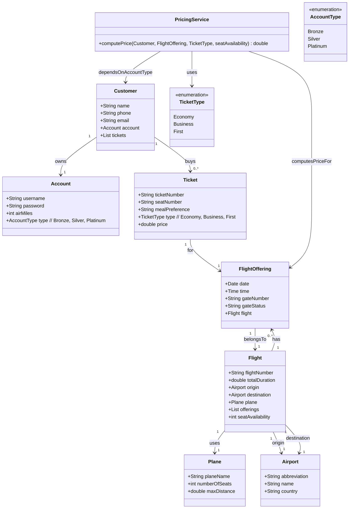

```mermaid
classDiagram
    %% ===== Entities =====
    class Customer {
        +String name
        +String phone
        +String email
        +Account account
        +List<Ticket> tickets
    }

    class Account {
        +String username
        +String password
        +int airMiles
        +AccountType type  // Bronze, Silver, Platinum
    }

    class Flight {
        +String flightNumber
        +double totalDuration
        +Airport origin
        +Airport destination
        +Plane plane
        +List<FlightOffering> offerings
        +int seatAvailability
    }

    class Airport {
        +String abbreviation
        +String name
        +String country
    }

    class Plane {
        +String planeName
        +int numberOfSeats
        +double maxDistance
    }

    class FlightOffering {
        +Date date
        +Time time
        +String gateNumber
        +String gateStatus
        +Flight flight
    }

    class Ticket {
        +String ticketNumber
        +String seatNumber
        +String mealPreference
        +TicketType type  // Economy, Business, First
        +double price
    }

    class PricingService {
        +computePrice(Customer, FlightOffering, TicketType, seatAvailability) double
    }

    %% ===== Enumerations =====
    class AccountType {
        <<enumeration>>
        Bronze
        Silver
        Platinum
    }

    class TicketType {
        <<enumeration>>
        Economy
        Business
        First
    }

    %% ===== Relationships =====
    Customer "1" --> "1" Account : owns
    Customer "1" --> "0..*" Ticket : buys
    Flight "1" --> "1" Plane : uses
    Flight "1" --> "1" Airport : origin
    Flight "1" --> "1" Airport : destination
    Flight "1" --> "0..*" FlightOffering : has
    Ticket "1" --> "1" FlightOffering : for
    FlightOffering "1" --> "1" Flight : belongsTo
    PricingService --> FlightOffering : computesPriceFor
    PricingService --> TicketType : uses
    PricingService --> Customer : dependsOnAccountType

```

